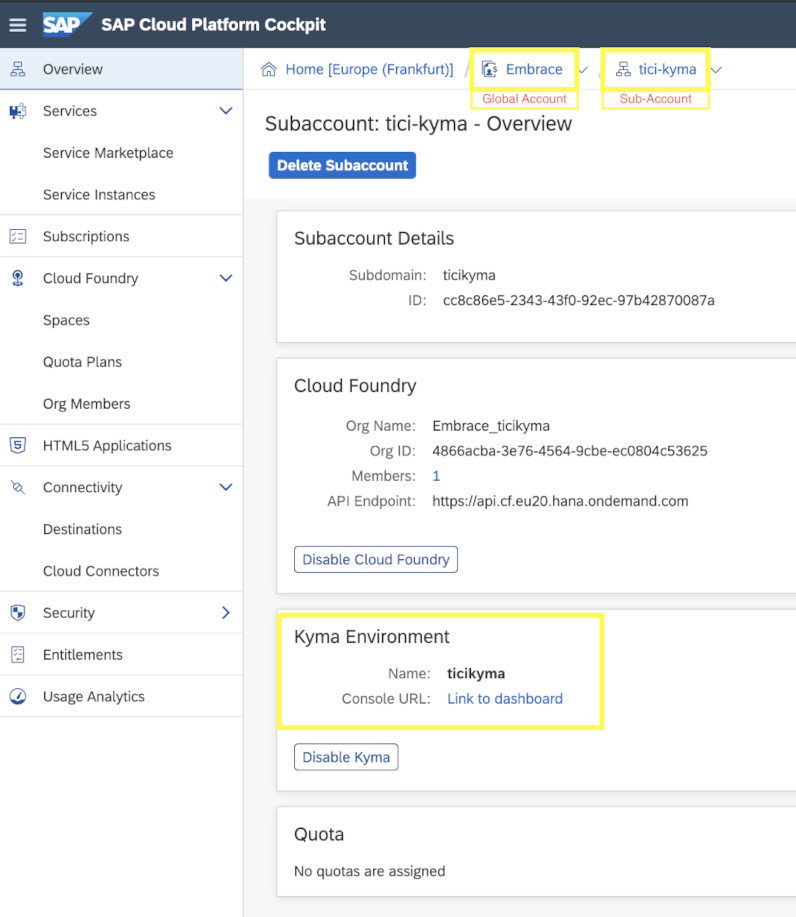
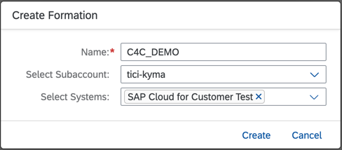
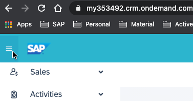
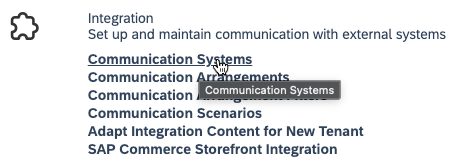
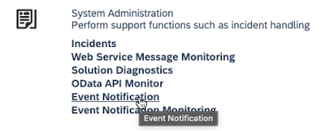
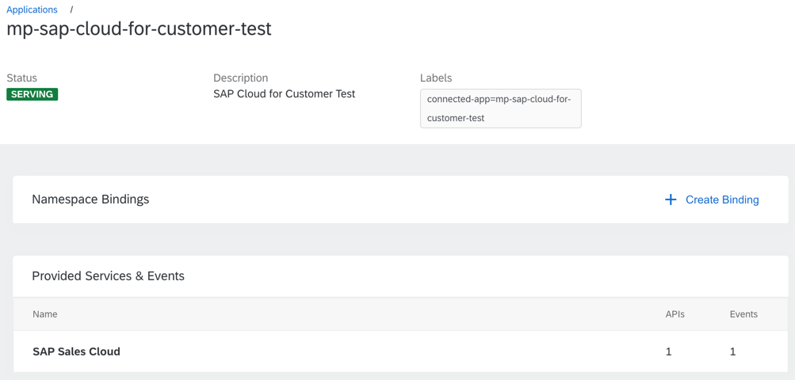
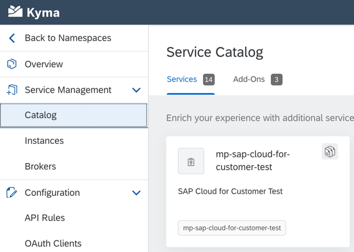
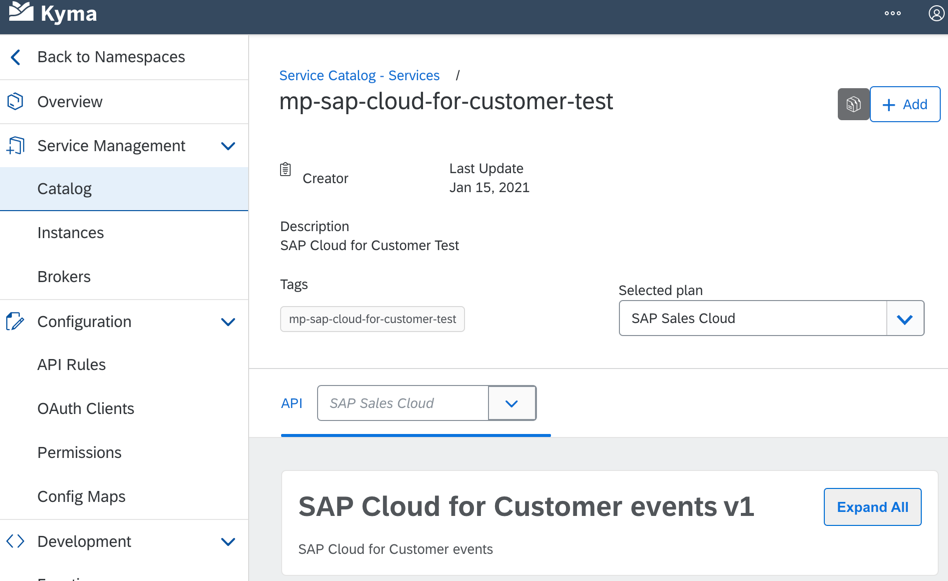

## Enablement of Kyma Runtime

Prerequisite on SAP Business Technology Platform is the Kyma Runtime, as entire uses cases is based on Kyma,
make sure that is enabled on your SAP BTP sub-account.
User should be administrator on SAP BTP for Global Account where changes taking place.
An SAP Sales Cloud tenant required as well.



## Enablement SAP Sales Cloud (C4C) on SAP Business Technology Platform
These are the step to set up SAP Sales Cloud/Sales for Customer catalog service on BTP.

On SAP Business Technology Platform Cockpit under global account.

- Select <code>System Landscape -> Systems</code>; Click the <code>Register System</code> button;
  
  

- Click the <code>Register</code> button. After registering a new record will come up in <code>Pending</code> status.
  
  

- Select <code>System Landscape -> Formations</code>; Click the <code>Create Formation</code> button;
  
  

## Setup SAP Sales Cloud (C4C) System

Login into SAP Sales Cloud/Sales for Customer(C4C) portal using admin user and password,
by using a similar URL <i>https://myXXXXXX.crm.ondemand.com </i>.

<u>Navigate under <code>Administrator -> General Settings -> Communication Systems</code>.</u>





On the opened tab <code>All Communication Systems</code> click the <code>New</code> button from top right.
On the new form introduce all required information about the system including the ID of the system.
For current example gave the ID <code>US_SALES_MIDDLEWARE_DEMO (feel free to give any name you want)</code>. 
As value for Host Name field should be the Kyma host URL(for instance <i>https://gateway.XXc2fb6.kyma.shoot.live.k8s-hana.ondemand.com</i>)


System is in <code>In Preparation</code> state/status. The target is to be into the <code>Active</code> state/status.
Select the system record and activate it by clicking the <code>Actions -> Set to Active</code>


---

<u>Navigate under <code>Administrator -> General Settings -> Communication Arrangements</code></u>


On the opened tab <code>All Communication Arrangements</code> click the <code>New</code> button from the top right. A wizard dialog will be opened.

- Select from <code>Communication Scenarios</code>, the <code>OData Services for Business Objects</code> record.
- Click the button <code>Next</code> from the bottom right.
- Select created by you yearly system for this example <code>US_SALES_MIDDLEWARE_DEMO</code> on <code>System Instance ID</code>.
- Click the button <code>Next</code> from the bottom right.
- Select best fit <code>Authentication Method</code>; I selected <code>User ID and Password</code>.
  The <code>User ID</code> is autogenerated as <code>_US_SALES__0</code>, can be changed, as well specify the password by clicking the <code>Edit Credentials</code> button, we will need them later on.
  Select <code>Services Used</code> fitting to your uses case (selected are <code>activity, activityplanprocessing, contact</code>).
- Click the button <code>Next</code> from the bottom right.
- Review and click the button <code>Finish</code> from eth bottom right.

Now you should be able to see the created arrangements on the list.

    
---

<u>Navigate under <code>Administrator -> General Settings -> Event Notification</code></u>



On the opened tab under <code>All Consumers</code> click the <code>Add</code> button from the top right.

- For the field <code>Type</code> select <code>SAP Cloud Platform Extensions</code>. Give a convinient for you name, used <code>SALES_MIDDLEWARE_DEMO_KYMA</code>.
- For the field <code>Remote Environment URL</code> go to BTP Cockpit and take the token url. Copy the generated url token by click the key on registered early by you system.
  
  
  
  
  
- For the field <code>Callback User</code> take existent or create a new technical user into SAP Sales Cloud and specify here the username.
- For the field <code>Callback Password</code> take the password of chosen technical user.
- Click the button <code>Save</code> from bottom right.

- Click new created consumer record <code>SALES_MIDDLEWARE_DEMO_KYMA</code> and activate it by clicking <code>Actions -> Activate</code>;
  State should change from <code>Inactive -> Active</code>


- Select consumer record <code>SALES_MIDDLEWARE_DEMO_KYMA</code> and add subscriptions on the <code>Subscriptions</code> dialog and click the button <code>Add</code>.
  On popped dialog configure event subscription for which you are interested into to receive events on BTP Kyma Message broker or Cloud Foundry:
    - As <code>Business Object</code> select <code>Account</code>
    - As <code>Node</code> select <code>Root</code>
    - Enable <code>Created, Updated</code>
    - Click the button <code>Save</code>
      Keep adding as much as you consider the subscription for which you want to receive events.

  <!--  -->

After these steps on BTP <code>System Landscape -> Systems</code>, the registered system should be in <code>Registered</code> state.


    
---

## Kyma Runtime Cockpit Operations

On Kyma Console/Cockpit click on <code>Applications/Systems</code>, your should be able to see integrated early created
system under name <code>mp-sap-cloud-for-customer-test</code>, and in state/status <code>SERVING</code>.


<br/>Details should look like:



<br/>Bind this system to a specific K8S namespace by clicking <code>+ Create Binding</code> and select the K8S namespace,
where the service will be deployed, we are using "default" namespace.

---

Navigating to selected namespace into <code>Service Management -> Catalog</code>. You should be able to see the service.



Details of created service:



---

Provision the Service Class in the selected (example is using <code>default</code>) Namespace, by clicking the <code>+ Add</code> button,
and give a more friendly name.


---

Deploy the lambda function by following the guidance from [deployments](../deployments)

---

To have calls from Kyma Function toward
[SAP Sales Cloud OData API]("https://help.sap.com/viewer/1364b70b9cbb417ea5e2d80e966d4f49/2002/en-US/6c0a463cc9ca450cbd01a9a5057ce682.html"),
make sure that exist a service binding usage of your services <code>c4c-address-verification</code>
under created service instance <code>mp-sap-cloud-for-customer-test-pesky-bug</code>.

---

Now is time to add triggers for events.
Using Kyma Console/Cockpit <code>“Discovery and Network -> Services”</code>.
Select <code>“c4c-address-verification”</code> service. Click on the button <code>“+ Create Event Subscription”</code>,
select following events only: <code>Account.Root.Created</code> and <code>Account.Root.Updated</code>.

--- 

Check the logs of pod using Kyma Console/Cockpit or command line, seeing that everything is on green:

```shell
kubectl logs -f <name of function pod> function
```

## SAP Sales Cloud Operations

As last step ensure that lambda function was deployed on Kyma Runtime without any errors, Event Subscription was attached to it.
Operation on SAP Sales Cloud for Account could be done, by manipulating the addresses, and watching how the address is verified and updated.

## Dependencies
- [Kyma](https://kyma-project.io)
- [Sales for Customer(C4C)](https://gdm-public-2020-emea.demo.hybris.com/gdm-cockpit/)

